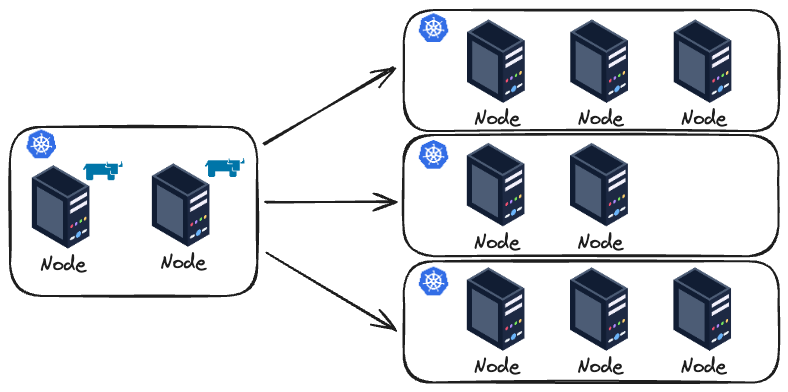

# Rancher

## Overview

- **The problem**: Manage Kubernetes at scale is complex and a real challenge. You need to manage things such as: multi-cluster, standardization, security/access, deploy applications consistently across clusters.
- **What is Rancher?**: Rancher is an open-source platform to simplify the deployment, management and operation of Kubernetes clusters (cloud, on-prem or hybrid). It makes it easier to solve the mentioned problem because:
1) It act as a centralized tool for managing all clusters
2) You can use GUI and CLI
3) Cluster provisionment is all done by Rancher, which is perfect in perfect for on-premise clusters
4) Provides authentication and RBAC for access/permission control
5) provides built-in monitoring and logging compatible with Prometheus and Grafana

and many more!

- **Basic Diagram**: I'm a very visual person, so even simple diagrams help me visualize things.

## Deployment and Installation
Rancher can be deployed in several cloud providers (AWS, GCP, Azure, Linode, DigitalOcean...) or in bare metal. You can use your preferred IaC tool (such as Terraform, Pulumi or even Ansible) to configure and deploy the environment that will have Rancher installed. In this blog post I will use a virtual machine, provisioned via Vagrant, that will deploy Rancher using Terraform. It really doesn't matter the deployment method you are going to use, you just need to make sure that Rancher is able to reach (network) the Kubernetes cluster that its going to provision/manage.

Rancher can be [installed](https://ranchermanager.docs.rancher.com/getting-started/installation-and-upgrade#overview-of-installation-options) in several different ways. There is not a right or wrong, which one has pros and cons when compared to another methods. Let's check few ways of doing that:

- **Multi-cluster**: For production environment you NEED high availability, so you should set up at least three (3) nodes when using RKE and two (2) nodes when using K3S. Using Helm as a Kubernetes Package Manager makes your fine easier to install Rancher on multiple nodes on a Kubernetes cluster.

- **Single-node**: As you can imagine, a single node running Rancher good for testing, cost-saving and non-critical environments, not for production. For testing and demonstration purposes you can even install Rancher using Docker!

Ok.. Now that we know that we can deploy in a multi-cluster or single-node way, where we are actually installing Rancher? And how we are going to use Helm to install Rancher if we don't even hava a running Kubernetes cluster at first? To answer this let's comment about bootstrapping.

### Bootstraping
Bootstrap is the initial process of setting up a system/environment with basic components, dependencies, configuration. According to the documentation, it's recommended to use [K3s](https://k3s.io/) or [RKE](https://rke.docs.rancher.com/). So you can simply create a Kubernetes cluster to install Rancher using these tools.

One very important thing: It is NOT recommended to run workload in this cluster. This cluster should be used entirely for Rancher and will serve as the control plane for managing the other clusters.

